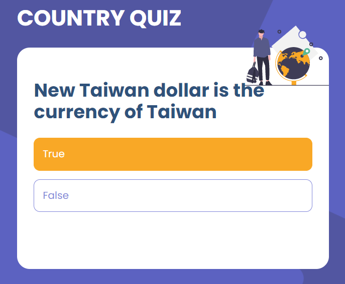
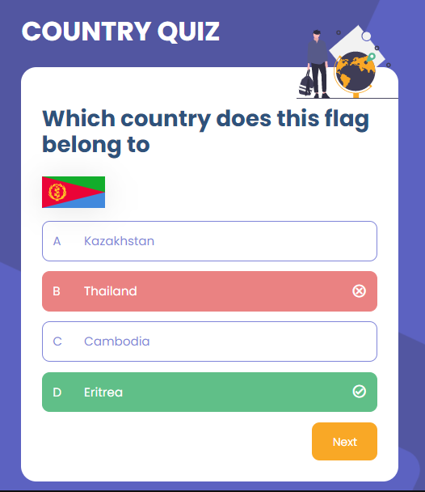

# Country Quiz 

---

## Tabla de contenido
---

- [Vista general](#vista-general)
- [Sobre el proyecto](#sobre-el-proyecto)
- [Recursos](#recursos)
- [Construido con](#construido-con)
- [Comó usarlo](#como-usarlo)

## Vista General

---

Pregunta verdadero o falso



Pregunta con opciones



## Sobre el proyecto

---

Esta aplicación de preguntas sobre países, se realizó con la librería de React junto con Redux y fetch con el siguiente endpoint [URL Rest Country](https://restcountries.com/v3.1/all), cabe destacar que las preguntas se generan de manera aleatoria, con el fin de dar dinamismo y evitar la repetición poniendo en práctica conceptos de CSS como de JavaScript.

## Recursos

---

Esta aplicación fue construida en base al reto Country Quiz del sitio [DevChallenge](https://devchallenges.io/challenges/Bu3G2irnaXmfwQ8sZkw8), usando el API [REST COUNTRIES](https://restcountries.com/).

## Construido con

---

- Vite
- React
- Hooks
- Emotion
- Redux
- Redux-Thunk

## Como usarlo

---

Comandos para la terminal

```bash
# Instalar dependencias
$ npm install

# Correr la app
$ npm run dev
```